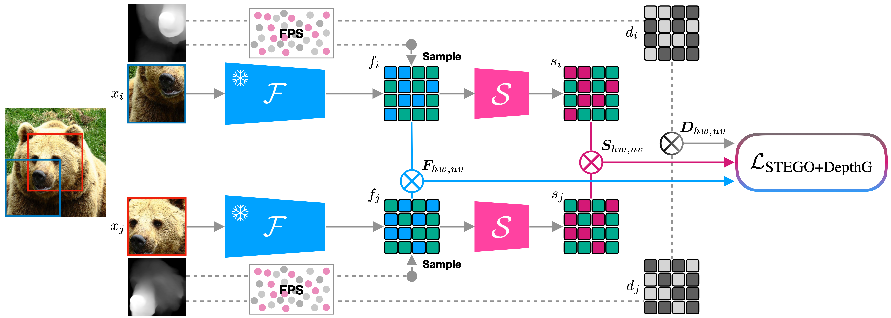

# Unsupervised Semantic Segmentation Through Depth-Guided Feature Distillation and Sampling

### [Project Page](https://leonsick.github.io/depthg/) | [Paper](https://arxiv.org/abs/2309.12378) | [Video](https://www.youtube.com/watch?v=-MlyVq8t51M)  


[Leon Sick](https://leonsick.github.io),
[Dominik Engel](https://dominikengel.com),
[Pedro Hermosilla](http://phermosilla.github.io),
[Timo Ropinski](https://viscom.uni-ulm.de/members/timo-ropinski/)

This repository contains the code for the paper "Unsupervised Semantic Segmentation Through Depth-Guided Feature
Distillation and Sampling", accepted at [CVPR](https://cvpr.thecvf.com) 2024.



## Setup
We will further streamline and polish this code after the conference with more explanations, comments and tutorials.
### Requirements

We have packaged all requirements in a `requirements.txt` file. To install them, run:
```
pip install -r requirements.txt
```

Note: We ran our experiments inside the PyTorch Cuda Development Container with
tag `pytorch/2.0.1-cuda11.7-cudnn8-devel`. If you encounter any issues, please try running the code inside the same
container. For more on the container,
see [here](https://hub.docker.com/layers/pytorch/pytorch/2.0.1-cuda11.7-cudnn8-devel/images/sha256-4f66166dd757752a6a6a9284686b4078e92337cd9d12d2e14d2d46274dfa9048).

### Dataset Preparation
First, make sure to download all desired datasets following the instructions from the original STEGO repository. These can be found [here](https://github.com/mhamilton723/STEGO).
Once you have set up all datasets, generate the depth maps for them using the `generate_depth.py` script. This script will generate depth maps for all images in the dataset and save them in the same directory as the images. To run the script, use the following command:
```
python generate_depth.py --dataset_path path/to/dataset --dataset dataset_name --split train --output_path path/to/dataset/depth
```
For example, to generate depth maps for the Cityscapes dataset, I ran:
```
python3 generate_depth.py --data_dir /home/leon/datasets/datasets/ --dataset cityscapes --split train --output_dir /home/leon/datasets/datasets/cityscapes/depth/train
```

### Five-crop and nearest-neighbor preparation
Before you can start training, you may have to, depending on the dataset, five-crop the images and depth maps. The necessary script is `src/crop_datasets.py`. To run the script, use the following command:
```
python3 src/crop_datasets.py data_dir=/path/to/dataset output_root=/path/to/crop/output dataset_name=cocostuff depth_type=zoedepth
```

Then, prepare the knn file used to select positive examples during training using the `src/precompute_knns.py` script. To run the script, this command can be used as a template:
```
python3 src/precompute_knns.py model_type=vit_base dim=90 data_dir=/path/to/datasets/ output_root=/path/to/outputs/ dataset_name=cocostuff27
```

## Training
For training, hydra configuration files are used. These can be overwritten by passing the desired values as command-line arguments. 
We have aggregated all scripts using our training configurations in the `paper_reproduction.sh` script. To run the script, use the following command:
```
bash paper_reproduction.sh
```

## Evaluation
To evaluate the model, use the `src/eval_segmentation.py` script. Make sure to first set the correct path to the checkpoint in /src/configs/eval_config.yml. To run the script, use the following command:
```
python3 src/eval_segmentation.py
```

## Pretrained Models
We provide pretrained models for all experiments in the paper. These can be found [here](https://drive.google.com/drive/folders/1vaSsTbpObcWygw1NJ8INltiM2PuKyPYj?usp=share_link).

## Citation
If you like our work, please consider citing our paper:
```
@inproceedings{sick2024unsupervised,
  title={Unsupervised Semantic Segmentation Through Depth-Guided Feature Distillation and Sampling},
  author={Leon Sick, Dominik Engel, Pedro Hermosilla, Timo Ropinski},
  booktitle={CVPR},
  year={2024}
}
```
